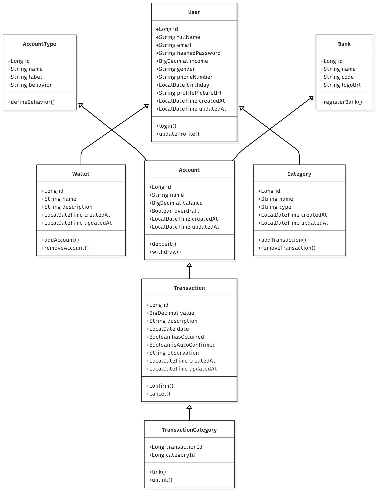

# Porquinho


[]()
[]()

O Porquinho é uma aplicação de controle financeiro pessoal desenvolvida para ajudar usuários a compreenderem seus hábitos financeiros e tomarem decisões mais conscientes sobre suas finanças.

O app permite o registro e acompanhamento de receitas, despesas e contas, promovendo uma visão clara sobre a situação financeira do usuário.

> Este repositório contém os arquivos da API Front Office, desenvolvida com Spring.

---

[Video Pitch](#video-pitch) | [Diagrama de Classes](#diagrama-de-classes) | [Diagrama Entidade Relacionamento](#diagrama-entidade-relacionamento) | [Endpoints Principais](#endpoints-principais) | [Setup do Projeto](#setup-do-projeto) | [Requisições para Teste](#requisições-para-teste) | [Stack Tecnológica](#stack-tecnológica) | [Evolução na Sprint](#evolução-na-sprint) | [Desenvolvedores](#desenvolvedores)

---

## Vídeo Pitch

**Assista no YouTube:** [https://youtu.be/uYpMm3QMLng](https://youtu.be/uYpMm3QMLng)


## Diagrama de Classes



## Diagrama Entidade Relacionamento


## Endpoints Principais

A seguir estão listados os principais endpoints disponíveis na API Front Office do projeto Porquinho.

### Carteiras

```
GET    /wallets/{id}    Retorna uma carteira  
GET    /wallets         Lista todas as carteiras  
POST   /wallets         Cria uma nova carteira  
PUT    /wallets/{id}    Atualiza uma carteira  
DELETE /wallets/{id}    Exclui uma carteira  
```

### Contas

```
GET    /accounts/{id}   Retorna uma conta  
GET    /accounts        Lista todas as contas  
POST   /accounts        Cria uma nova conta  
PUT    /accounts/{id}   Atualiza uma conta  
DELETE /accounts/{id}   Exclui uma conta  
```

### Usuários

```
GET    /users/{id}      Retorna um usuário  
GET    /users           Lista todos os usuários  
POST   /users           Cria um novo usuário  
PUT    /users/{id}      Atualiza um usuário  
DELETE /users/{id}      Exclui um usuário  
```

### Categorias

```
GET    /categories/{id} Retorna uma categoria  
GET    /categories      Lista todas as categorias  
POST   /categories      Cria uma nova categoria  
PUT    /categories/{id} Atualiza uma categoria  
DELETE /categories/{id} Exclui uma categoria  
```

### Transações

```
GET    /transactions/{id}   Retorna uma transação  
GET    /transactions        Lista todas as transações  
POST   /transactions        Cria uma nova transação  
PUT    /transactions/{id}   Atualiza uma transação  
DELETE /transactions/{id}   Exclui uma transação  
```

### Bancos

```
GET    /banks               Lista todos os bancos  
GET    /banks/{id}          Retorna um banco específico  
```

### Tipos de Contas

```
GET    /account-types       Lista todos os tipos de conta  
GET    /account-types/{id}  Retorna um tipo de conta  
```

## Setup do Projeto

### Instalação Local

Antes de iniciar, certifique-se de ter instalado:

- **Node.js** (versão 18 ou superior)
- **npm** ou **yarn**
- **Emulador Android** ou aplicativo **Expo Go** no dispositivo físico

```bash
# Clonar o repositório
git clone https://github.com/enzorva/porquinho-api.git

# Acessar o diretório
cd porquinho-api

# Instalar as dependências
mvn install

# Iniciar o projeto
mvn spring-boot:run
```

Após a inicialização, a API estará disponível em: http://localhost:8080  
A documentação interativa (Swagger UI) pode ser acessada em: http://localhost:8080/swagger-ui/index.html

### Execução Via Docker

Antes de iniciar, certifique-se de ter instalado:

- **Docker**

```bash
# Clonar o repositório
git clone https://github.com/enzorva/porquinho-api.git

# Acessar o diretório
cd porquinho-api

# Instalar as dependências
mvn install

# Construir a imagem do projeto
docker build -t porquinho-app .

# Executar o container
docker run -it --rm -p 8080:8080 porquinho-app
```

Após a inicialização, a API estará disponível em: http://localhost:8080  
A documentação interativa (Swagger UI) pode ser acessada em: http://localhost:8080/swagger-ui/index.html

## Requisições para Teste

O projeto inclui um script `requests.sh` com exemplos de requisições via `curl`.

## Stack Tecnológica

O projeto utiliza as seguintes tecnologias:

- Java 17 - Linguagem principal da API.  
- Maven - Gerenciador de dependências e build.  
- Spring Boot - Framework para configuração e execução da aplicação.  
- Spring Data JPA - Persistência e mapeamento de dados.  
- Oracle Database - Banco de dados relacional do projeto.  
- Docker - Containerização e padronização do ambiente.  

## Evolução na Sprint

Nesta sprint, realizamos avanços significativos no projeto:

- Correção de erros no modelo de entidades.
- Inclusão do Docker para facilitar a execução e o deploy da aplicação.
- Revisão e atualização do diagrama de classes.
- Inclusão do cronograma de desenvolvimento no repositório.
- Integração efetiva com o Oracle Database, garantindo a comunicação da aplicação com o orcl da FIAP.

## Desenvolvedores

[@AntonioDeLuca](https://github.com/antoniodeluca) - Desenvolvedor Backend  
[@EnzoAzevedo](https://github.com/enzoazevedo) - Desenvolvedor Backend  
[@PauloSérgioFB](https://github.com/paulgramador) - Desenvolvedor Mobile
